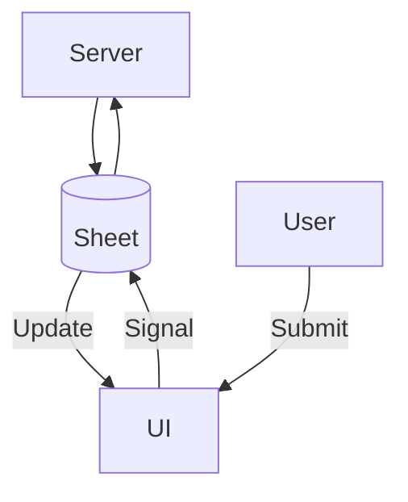

### 📌 **README - Abnormal Situation Leaderboard**  
📜📜**For detailed module usage and configuration, please refer to** [**PIA-Benchmark**](https://www.notion.so/piaspace/MACS-1606a557fb8e80059a18c85ec4898056?pvs=4).  

📜 **For historical details, please check past sprint records.**  

---

## **1. Project Overview**  

**Abnormal Situation Leaderboard** is a system designed to monitor and process benchmarking requests in real-time. It consists of:  

- **`main.py`** → Monitors changes in a **Sheet**, triggers benchmarking, and updates results.  
- **`app.py`** → A **Gradio-based UI** for submitting benchmarking requests.  
- **Independent Processes** → Both `main.py` and `app.py` run separately and communicate through Sheet updates.  

For detailed module usage and configuration, please refer to the **docs/** directory for additional documentation.

---

## **2. Folder Structure**  

```
📂 Abnormal_situation_leader_board
 ├── 📁 assets
 │   ├── 📁 {benchmark_name}
 │   │   ├── 📁 dataset
 │   │   ├── 📁 CFG
 │   │   ├── 📁 models
 │   │   │   ├── 📁 {model_name}
 │   │   │   │   ├── 📁 CFG
 │   │   │   │   ├── 📁 vector
 ├── 📜 requirement.txt
 ├── 📜 app.py          # Gradio UI for submitting requests
 ├── 📜 main.py         # Monitoring & benchmarking loop
 ├── 📜 README.md
```

---

## **3. Installation & Setup**  

### **🔹 1️⃣ Create & Activate Environment**  
```bash
conda create -n bench python=3.11
conda activate bench
pip install -r requirement.txt
```

### **🔹 2️⃣ Run the UI**  
```bash
python app.py
```
- Launches the **Gradio interface** for submitting benchmarking requests.

### **🔹 3️⃣ Run the Monitoring & Benchmarking System**  
```bash
python main.py
```
- **Monitors** the Sheet for changes.  
- **Processes benchmarking** when an update request is detected.  
---

## **4. Execution Flow**  



**Core Process:**  
1️⃣ **User submits a benchmarking request via UI** (`app.py`)  
2️⃣ **Sheet is updated**  
3️⃣ **Monitoring loop (`main.py`) detects the change**  
4️⃣ **Benchmarking process is executed**  
5️⃣ **Results are updated back to the Sheet**  

---

✅ **Independent execution of UI & Monitoring**  
✅ **Real-time monitoring & automated benchmarking**  
✅ **Modular & Scalable Structure**  
