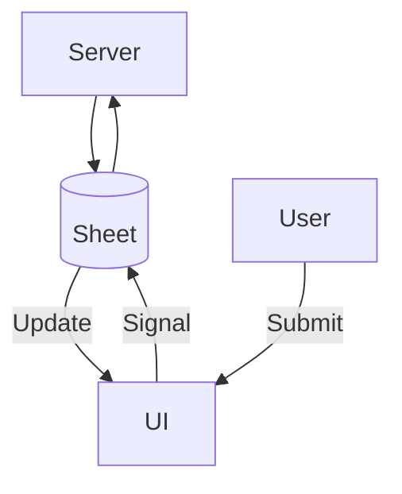

## **1. Overview**  

This system consists of two key components:  

1. **Main Loop (`main.py`)**  
   - Monitors changes in a **Sheet (database)**
   - Triggers benchmarking when values are updated  
   - Handles processing while pausing monitoring temporarily  

2. **UI (`app.py`) - Gradio Interface**  
   - Provides an interface for users to submit requests  
   - Sends signals to the server when values need to be updated  

Since **two separate processes** (`main.py` and `app.py`) are running simultaneously, they communicate through **Sheet updates and monitoring mechanisms**.

---

## **2. System Architecture**  

### **📌 Process Flow**  


- The **monitoring loop** in `main.py` continuously checks for value changes in the Sheet.  
- When a change is detected, it **triggers a benchmarking process** and updates the Sheet.  
- The UI (`app.py`) sends signals to update values, which the monitoring loop detects and processes.  

---

## **3. Code Structure**  

### **🔹 `main.py` - Main Monitoring Process**
- Runs the **monitoring loop** in a separate thread.  
- Detects changes in the **Sheet**.  
- Pauses monitoring while processing benchmark requests.  
- Uses `threading.Event` for synchronization between monitoring and processing.  

#### **Main Components**  

| Component | Description |
|-----------|------------|
| `SheetMonitor` | Runs a separate thread to monitor changes in the Sheet. |
| `pause()` / `resume()` | Temporarily stops/resumes monitoring when processing a request. |
| `value_changed` event | Triggers when a change is detected in the Sheet. |
| `MainLoop` | Handles the main processing logic. |
| `threading.Event` | Used for thread communication and synchronization. |

---

### **🔹 `app.py` - UI Process (Gradio)**
- Provides a **web-based UI** for users.  
- Allows users to submit **requests for Sheet updates**.  
- Sends signals to the **server (monitoring loop)** when values are updated.  
- Runs as an **independent process** (`gradio app.py`).  

---

## **4. Execution & Workflow**  

### **📌 Running the System**  

#### **1️⃣ Start the Monitoring Process (`main.py`)**
```bash
python main.py
```
- This will start the **monitoring loop** that listens for changes in the Sheet.

#### **2️⃣ Start the UI (`app.py`)**
```bash
python app.py
```
- This launches the **Gradio-based UI** where users can submit values.

---

### **📌 Processing Flow**  

```python
# 1. Monitoring thread detects changes in the Sheet.
# 2. value_changed event is triggered.
# 3. Main loop catches the event.
# 4. Monitoring is paused.
# 5. Benchmarking function is executed.
# 6. Monitoring resumes.
```

---

## **5. Synchronization Mechanism**  

- **`threading.Event`** is used for inter-thread communication.  
- **Monitoring Loop pauses** when processing a request and **resumes automatically** after completion.  
- Ensures that **only one process modifies the Sheet at a time** to prevent conflicts.  
